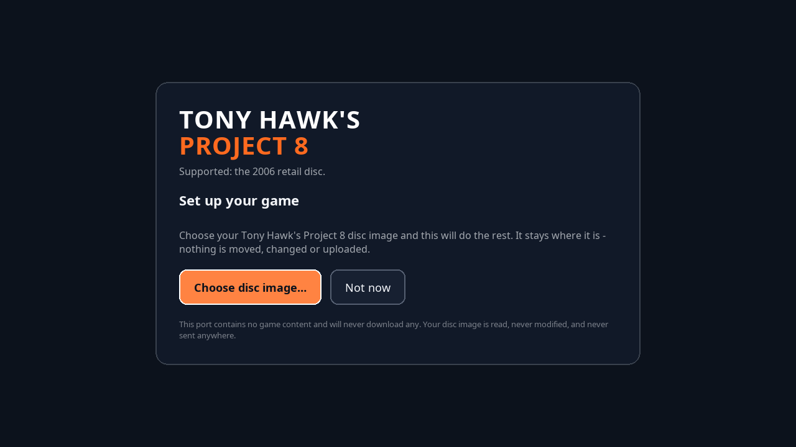

# Project8Recomp

A native port of **Tony Hawk's Project 8** (Xbox 360, 2006), built by static
recompilation. It is not an emulator: the game's PowerPC code is translated to
C++ ahead of time and compiled into a normal executable for your machine.

> **You must own a copy of Tony Hawk's Project 8 for Xbox 360.** This repository
> and its releases contain no disc image, original game executable, extracted
> assets, or other files copied from the disc. The launcher reads a disc image you
> supply from your own copy, checks it is a supported release, and sets up an
> install on your machine. Nobody here has a copy to give you. Asking in an
> issue, a discussion, or anywhere else will get the thread closed.

**[Download the latest release →](../../releases/latest)**

<p align="center">
  <a href="https://youtu.be/osIOQKiwaiU">
    
  </a>
  <br>
  <em>A minute of Free Skate, running natively on Linux. In-game music is muted in the recording.</em>
</p>

---

## Contents

- [Platforms](#platforms)
- [What you need](#what-you-need)
- [Installing](#installing)
- [Known issues](#known-issues)
- [FAQ](#faq)
- [Building from source](#building-from-source)
- [Legal](#legal)
- [Credits](#credits)

## Platforms

| Platform | Status |
| --- | --- |
| Linux x86_64 | **Verified.** The main development and testing platform. |
| macOS arm64 | **Verified on Apple M1.** The archive is self-contained and renders correctly, but heavy scenes are still too slow for comfortable play; see [known issues](docs/KNOWN_ISSUES.md). |
| Windows x86_64 | **Experimental.** The complete archive works under Proton, but has not yet been tested on real Windows hardware. |

### Steam Deck performance

v0.3.0 substantially improves busy-scene performance. In a repeatable late-game
Funpark view with about 2,667 draws per frame, the native Linux build improved
from **40.01 to 45.58 effective FPS**. Mean frame time fell from **25.00 to
21.94 ms**, p95 fell from **27.00 to 23.00 ms**, and process CPU fell from
about **258% to 223%**. These are uncapped measurements from the same Steam
Deck LCD and scene, not a claim that every area now holds 60 FPS.

The Windows situation, plainly: everything is cross-compiled from Linux,
because nobody on this project owns a Windows machine. The complete v0.3.0
archive was tested through Proton 10 on a Steam Deck. The launcher and game
started, and the late-game 2,600-plus-draw fixture rendered every expected
checkpoint. The player-default path held 30 FPS with a **33.32 / 34.25 ms p50 /
p95**; uncapped, it measured **27.01 / 30.99 ms** and **36.30 effective FPS**.
That is useful compatibility and performance evidence, but it is not a test on
Windows. Proton is a different implementation of the same interfaces, and the
places where it differs are precisely where an untested port can break.

If you try the Windows launcher, please tell us what happened. "It opened and
the buttons worked" is as useful to us as a crash report, and there is
[a template](../../issues/new?template=windows_report.yml) for it.

## What you need

- Your own copy of Tony Hawk's Project 8 for Xbox 360.
- A disc image of it (`.iso`). You do not need to extract it; the launcher
  reads the image directly.
- About 5 GB of free space.
- A GPU with Vulkan support.

## Installing

<p align="center">
  
</p>

1. Download the release for your platform and unpack it anywhere you can write.
2. Run `Project8Recomp` (`Project8Recomp.exe` on Windows). On Steam Deck, add
   this file as a Non-Steam Game and do not force Proton for the Linux build.
3. It asks for your disc image. Point it at your `.iso`.
4. It checks the image. This takes well under a second and copies nothing yet.
   A disc that is not the supported release is refused here, before 4.7 GB is
   written rather than after.
5. On a match it copies the game data into the same folder. This takes a few
   minutes, and you can stop it.
6. The game starts. From then on `Project8Recomp` goes straight through the
   launcher to Play. Run `Project8Recomp --gui` whenever you want settings,
   setup status, or the normal launcher home screen.

The v0.1.0 executable names remain in the folder and keep their old behaviour,
so existing shortcuts continue to work. The new entry is a small wrapper over
`thps_p8_gui`; it never starts the game binary directly, which means launch
settings, single-instance handling, the supervisor, and crash cleanup stay on
the same path.

Everything lives in that one folder: the game data, your saves, and your
settings. Move it, copy it between your own machines, or delete it. Nothing is
written elsewhere on your system.

**macOS:** the archive includes its Vulkan runtime, so Homebrew is not required.
It is ad-hoc signed but not notarized, so Gatekeeper will refuse a double-click.
Right-click → **Open** → **Open**, once per install.

**Windows:** the binary is not signed, so SmartScreen will show "Windows
protected your PC". **More info** → **Run anyway**.

More detail, including the accepted disc hash and where things live:
**[docs/SETUP.md](docs/SETUP.md)**.

## Known issues

The one worth knowing before you play: **leave the frame rate cap on.** It is
the default. With it off, in-level cutscenes run three to five times too fast.

Full list, including what is implemented but unverified:
**[docs/KNOWN_ISSUES.md](docs/KNOWN_ISSUES.md)**.

## FAQ

<details>
<summary><b>Is this an emulator?</b></summary>

No. An emulator interprets or JIT-compiles the console's instructions while you
play. This translates them to C++ once, ahead of time, and compiles a native
binary. The result runs as a normal application on your CPU.
</details>

<details>
<summary><b>Why isn't the game included?</b></summary>

Because it is not ours to give you. The release carries the runtime; your disc
carries roughly 4.7 GB of content that will never be distributed here. A
runtime without a copy of the game has nothing to run.
</details>

<details>
<summary><b>The launcher rejected my disc image. Why?</b></summary>

It hashes `default.xex` inside the image and compares it against the releases
this port was built from. Today that is one: the 2006 retail disc listed in
[docs/SETUP.md](docs/SETUP.md). It will distinguish three cases: a file that is
not a disc image, a different game, or the right game from a different release.

If you own a PAL or NTSC-J disc, the hash and size of its `default.xex` are
genuinely useful to us. Those two values are all it takes to add support for a
release. **Do not send the file itself.**

The tool that does the checking will print them for you. From the folder you
unpacked:

```bash
# Linux / macOS
./thps_p8_identify --identify_disc=/path/to/your.iso --json
```

```powershell
# Windows
.\thps_p8_identify.exe --identify_disc="D:\path\to\your.iso" --json
```

It prints something like:

```
  default.xex sha256: 1a2b3c...
  default.xex size:   8237056 bytes
```

Paste those two lines into an issue, along with the region printed on your disc.
</details>

<details>
<summary><b>Where are my saves and logs?</b></summary>

Saves are in `saves/` and logs are in `logs/`, both inside the folder you
unpacked. The launcher home screen has a button for each folder.
</details>

<details>
<summary><b>Can I get more than 60 fps?</b></summary>

Yes, by turning the cap off in the launcher's Display settings. Read the
[known issues](docs/KNOWN_ISSUES.md) first because in-level cutscenes break
when you do this.
</details>

<details>
<summary><b>My antivirus flagged it.</b></summary>

Static recompilations can resemble packers or injectors to heuristic scanners,
but do not dismiss a warning blindly. Download only from this repository's
release page, verify the archive and its `SHA256SUMS`, and tell us the engine
and detection name so we can investigate it.
</details>

## Building from source

Most people do not need to. If you want to: the launcher builds in about a
minute from nothing but a compiler and SDL3, and the game needs your own copy
because the recompiler reads `default.xex` as its input.

**[docs/BUILDING.md](docs/BUILDING.md)**

## Legal

**Ownership.** You must own a copy of Tony Hawk's Project 8 for Xbox 360. This
repository and its releases contain no disc image, original game executable,
extracted assets, or other files copied from the disc.

**Non-affiliation.** Tony Hawk's Project 8 is a trademark of Activision
Publishing, Inc. Tony Hawk is a trademark of Tony Hawk. Xbox 360 and related
marks are trademarks of Microsoft Corporation. This is an independent,
non-commercial preservation project. It is not affiliated with, sponsored by, or
endorsed by Activision, Neversoft, Tony Hawk, Microsoft, or any other rights
holder. All trademarks and copyrights belong to their respective owners.

**What the licence covers.** The source in this repository includes the
launcher, disc identity worker, supervisor, game host code, recompiler
configuration, build scripts, and documentation. It is under the BSD 3-Clause
License ([LICENSE](LICENSE)). Third-party components are used under their own
licences, reproduced in full in [NOTICE](NOTICE).

It does **not** cover anything derived from the game. The translation units the
recompiler generates from `default.xex` are not published as source and are not
licensed by this project. Release archives contain the compiled recompilation,
but no original executable or extracted disc asset; the BSD licence grants no
rights in the underlying title. Do not redistribute your generated sources or
game files.

**Do not request or share game files.** Issues, discussions and pull requests
asking where to obtain the game will be closed without an answer. Pull requests
containing game assets, decrypted intermediates, platform keys or generated
translation units will be rejected; see [CONTRIBUTING.md](CONTRIBUTING.md).

## Credits

- **[ReXGlue](https://github.com/rexglue/rexglue-sdk)** by Tom Clay: the static
  recompilation runtime this is built on.
- **[Xenia](https://github.com/xenia-project/xenia)**: the Xbox 360 emulation
  work ReXGlue derives from. None of this exists without it.
- **[XenonRecomp](https://github.com/hedge-dev/XenonRecomp)** and
  **[rexdex's recompiler](https://github.com/rexdex/recompiler)**: for
  pioneering this approach on the platform.
- **FFmpeg** (LGPL-2.1), **RmlUi** (MIT), **SDL3** and **SDL3_image** (Zlib),
  **FreeType**, **Noto Sans** (OFL-1.1).

Portions of this software are copyright © The FreeType Project
(www.freetype.org). All rights reserved.

Full licence texts: **[NOTICE](NOTICE)**.
