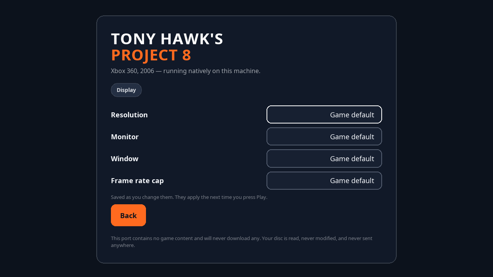

# Setting up

You need your own copy of Tony Hawk's Project 8 for Xbox 360, and a disc image
made from it. This project supplies the runtime; the disc supplies about 4.7 GB
of game content that will never be distributed here.

Nobody involved in this project has a copy to give you, and asking will get the
thread closed. That is the only thing this page will say on the subject.

## What the launcher accepts

A disc image of the 2006 retail release, as a `.iso` (or `.img`). The launcher
reads it directly — there is no need to extract it yourself first.

| Release | `default.xex` SHA-256 | Size |
| --- | --- | --- |
| Tony Hawk's Project 8, 2006 retail disc | `cfc732340e55defda400e25f03231aa9bb65fd9545b618212f69a4952384a5dd` | 8,237,056 bytes |

That is the only accepted entry today.

## The other releases

Project 8 shipped in more than one form on Xbox 360, and only the first is
supported. If the launcher rejects your disc, that is expected rather than a
bug.

| Release | Title ID | Media ID | Notes |
| --- | --- | --- | --- |
| World v1.0 (USA/Europe) | `415607DD` | `2CB96AE4` | Region-free. **The supported one.** |
| Japan v1.0 | `41560810` | `05728741` | NTSC-J. A different title ID, so a different executable. |
| Korea | unknown | unknown | A physical release is confirmed to exist; its disc identity is unresolved. |
| Demo v1.0 | — | `2932D558` | Disc label AV202950W0X11. |

Adding a release is a data change rather than a change to the gate, but it
needs the executable's hash confirmed against a disc someone actually holds —
we will not add a row on hearsay.

So if you own any of these, the SHA-256 and size of its `default.xex` are the
most useful thing you could send us. **Do not send the file.** The Korean disc
in particular is a genuine gap: nobody appears to have published its identity at
all.

## What happens on first run

1. You pick your disc image.
2. The launcher mounts it and hashes `default.xex` inside it. This takes well
   under a second, and nothing is copied yet.
3. If the hash is not in the table above, it stops and tells you which of three
   things went wrong: not a disc image at all, a different game, or the right
   game from a different release.
4. On a match, it copies the game data into a `game/` folder next to the
   launcher. This is the slow step — a few minutes, and you can stop it.
5. It writes `config/install.toml` and hands off to the game.

After that, the launcher goes straight to a Play button and you do not need the
disc image again on that machine.

The check runs before the copy on purpose: a wrong disc costs you a few hundred
milliseconds rather than 4.7 GB and a wait.

## Where everything lives

Everything is inside the folder you unpacked, and nothing is written outside it:

```
thps-p8/
├── Project8Recomp         player entry; setup first, then Play (--gui for launcher)
├── thps_p8_gui            the launcher
├── thps_p8                the game
├── thps_p8_launch         supervisor; cleans up after a crash
├── thps_p8_identify       reads and extracts disc images
├── assets/                the launcher's own UI
├── game/                  your extracted game data (created on first run)
├── saves/                 your saves
├── config/                settings.toml and install.toml
└── logs/
```

Move the folder wherever you like; copy it between your own machines and it
keeps working. Delete the folder and nothing remains.

`Project8Recomp` is additive. The four `thps_p8*` component names are unchanged
from v0.1.0, so an existing Steam shortcut or script does not need to be
rewritten. The player entry asks `thps_p8_gui` to Play by default; if setup is
missing or incomplete, the launcher remains on its first-run screen. Pass
`--gui` to open the launcher without requesting Play.

## Settings

The launcher's **Display** screen covers window size, which monitor to open on,
windowed or fullscreen, and whether the frame rate is capped. Each is
"Game default" until you change it, and each is written to
`config/settings.toml` as you change it.



A setting left at "Game default" is not written to the file and not passed to
the game at all, so the game's own default applies. That is deliberate: it means
the launcher never has to guess a value on your behalf.

Choosing a size without explicitly choosing Fullscreen opens a window at that
size. This detail matters: the runtime defaults to borderless fullscreen, which
uses the desktop dimensions and necessarily discards any requested window
dimensions. An explicit Fullscreen choice still wins. Named modes such as
720p are passed through to the runtime; the Deck's 1280x800 mode also sets the
host window and guest video-mode dimensions directly because it is not one of
the original title's named 16:9 presets.

Frame rate is worth one note: the cap is on by default and should stay on. With
it off, in-level cutscenes run several times too fast. See
[KNOWN_ISSUES.md](KNOWN_ISSUES.md).

The **Performance** setting is enabled on a fresh install. It selects the
title-specific runtime paths measured for this release; turning it off restores
the upstream-compatible paths for troubleshooting. It is independent of the
frame-rate cap.

## Controllers

A controller works without configuration, including if you plug it in after the
launcher is already open. The launcher itself is fully navigable with one: the
d-pad and stick move, A activates, B goes back, and the bumpers cycle through
every control on the screen.

## If something goes wrong

- **The launcher says the game is already running.** It is. Close it, or use
  the Stop button.
- **The launcher offers to free some memory.** A previous session crashed and
  left a shared memory segment behind. The button reclaims it.
- **The game will not start and says it cannot find game data.** The `game/`
  folder is missing or incomplete. Delete `config/install.toml` and run the
  launcher again to redo setup.
- **Anything else.** `logs/` and the terminal output are what a bug report
  needs.
